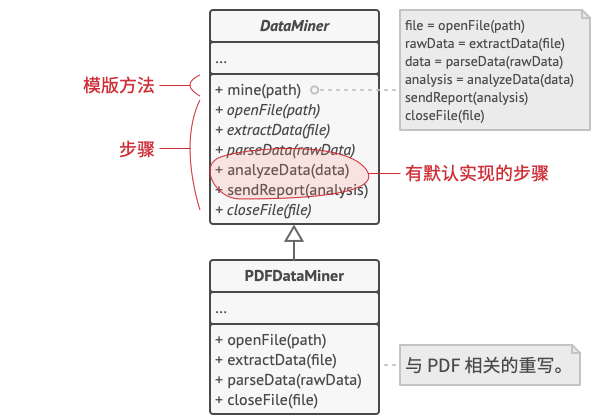
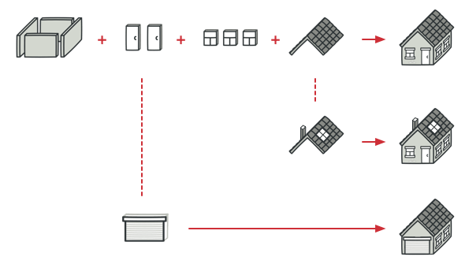

# 模板方法模式

亦称：Template Method

##  意图

**模板方法模式**是一种行为设计模式， 它在超类中定义了一个算法的框架， 允许子类在不修改结构的情况下重写算法的特定步骤。


##  问题

假如你正在开发一款分析公司文档的数据挖掘程序。 用户需要向程序输入各种格式 （PDF、 DOC 或 CSV） 的文档， 程序则会试图从这些文件中抽取有意义的数据， 并以统一的格式将其返回给用户。

该程序的首个版本仅支持 DOC 文件。 在接下来的一个版本中， 程序能够支持 CSV 文件。 一个月后， 你 “教会” 了程序从 PDF 文件中抽取数据。


数据挖掘类中包含许多重复代码。

一段时间后， 你发现这三个类中包含许多相似代码。 尽管这些类处理不同数据格式的代码完全不同， 但数据处理和分析的代码却几乎完全一样。 如果能在保持算法结构完整的情况下去除重复代码， 这难道不是一件很棒的事情吗？

还有另一个与使用这些类的客户端代码相关的问题： 客户端代码中包含许多条件语句， 以根据不同的处理对象类型选择合适的处理过程。 如果所有处理数据的类都拥有相同的接口或基类， 那么你就可以去除客户端代码中的条件语句， 转而使用多态机制来在处理对象上调用函数。

##  解决方案

模板方法模式建议将算法分解为一系列步骤， 然后将这些步骤改写为方法， 最后在 “模板方法” 中依次调用这些方法。 步骤可以是 `抽象`的， 也可以有一些默认的实现。 为了能够使用算法， 客户端需要自行提供子类并实现所有的抽象步骤。 如有必要还需重写一些步骤 （但这一步中不包括模板方法自身）。

让我们考虑如何在数据挖掘应用中实现上述方案。 我们可为图中的三个解析算法创建一个基类， 该类将定义调用了一系列不同文档处理步骤的模板方法。



模板方法将算法分解为步骤， 并允许子类重写这些步骤， 而非重写实际的模板方法。

首先， 我们将所有步骤声明为 `抽象`类型， 强制要求子类自行实现这些方法。 在我们的例子中， 子类中已有所有必要的实现， 因此我们只需调整这些方法的签名， 使之与超类的方法匹配即可。

现在， 让我们看看如何去除重复代码。 对于不同的数据格式， 打开和关闭文件以及抽取和解析数据的代码都不同， 因此无需修改这些方法。 但分析原始数据和生成报告等其他步骤的实现方式非常相似， 因此可将其提取到基类中， 以让子类共享这些代码。

正如你所看到的那样， 我们有两种类型的步骤：

- *抽象步骤*必须由各个子类来实现
- *可选步骤*已有一些默认实现， 但仍可在需要时进行重写

还有另一种名为*钩子*的步骤。 *钩子*是内容为空的可选步骤。 即使不重写钩子， 模板方法也能工作。 钩子通常放置在算法重要步骤的前后， 为子类提供额外的算法扩展点。

##  真实世界类比



可对典型的建筑方案进行微调以更好地满足客户需求。

模板方法可用于建造大量房屋。 标准房屋建造方案中可提供几个扩展点， 允许潜在房屋业主调整成品房屋的部分细节。

每个建造步骤 （例如打地基、 建造框架、 建造墙壁和安装水电管线等） 都能进行微调， 这使得成品房屋会略有不同。

##  模板方法模式结构


1. **抽象类** （Abstract­Class） 会声明作为算法步骤的方法， 以及依次调用它们的实际模板方法。 算法步骤可以被声明为 `抽象`类型， 也可以提供一些默认实现。
2. **具体类** （Concrete­Class） 可以重写所有步骤， 但不能重写模板方法自身。

##  伪代码

本例中的**模板方法**模式为一款简单策略游戏中人工智能的不同分支提供 “框架”。


一款简单游戏的 AI 类。

游戏中所有的种族都有几乎同类的单位和建筑。 因此你可以在不同的种族上复用相同的 AI 结构， 同时还需要具备重写一些细节的能力。 通过这种方式， 你可以重写半兽人的 AI 使其更富攻击性， 也可以让人类侧重防守， 还可以禁止怪物建造建筑。 在游戏中新增种族需要创建新的 AI 子类， 还需要重写 AI 基类中所声明的默认方法。

```
// 抽象类定义了一个模板方法，其中通常会包含某个由抽象原语操作调用组成的算
// 法框架。具体子类会实现这些操作，但是不会对模板方法做出修改。
class GameAI is
    // 模板方法定义了某个算法的框架。
    method turn() is
        collectResources()
        buildStructures()
        buildUnits()
        attack()

    // 某些步骤可在基类中直接实现。
    method collectResources() is
        foreach (s in this.builtStructures) do
            s.collect()

    // 某些可定义为抽象类型。
    abstract method buildStructures()
    abstract method buildUnits()

    // 一个类可包含多个模板方法。
    method attack() is
        enemy = closestEnemy()
        if (enemy == null)
            sendScouts(map.center)
        else
            sendWarriors(enemy.position)

    abstract method sendScouts(position)
    abstract method sendWarriors(position)

// 具体类必须实现基类中的所有抽象操作，但是它们不能重写模板方法自身。
class OrcsAI extends GameAI is
    method buildStructures() is
        if (there are some resources) then
            // 建造农场，接着是谷仓，然后是要塞。

    method buildUnits() is
        if (there are plenty of resources) then
            if (there are no scouts)
                // 建造苦工，将其加入侦查编组。
            else
                // 建造兽族步兵，将其加入战士编组。

    // ...

    method sendScouts(position) is
        if (scouts.length > 0) then
            // 将侦查编组送到指定位置。

    method sendWarriors(position) is
        if (warriors.length > 5) then
            // 将战斗编组送到指定位置。

// 子类可以重写部分默认的操作。
class MonstersAI extends GameAI is
    method collectResources() is
        // 怪物不会采集资源。

    method buildStructures() is
        // 怪物不会建造建筑。

    method buildUnits() is
        // 怪物不会建造单位。
```

##  模板方法模式适合应用场景

 当你只希望客户端扩展某个特定算法步骤， 而不是整个算法或其结构时， 可使用模板方法模式。

 模板方法将整个算法转换为一系列独立的步骤， 以便子类能对其进行扩展， 同时还可让超类中所定义的结构保持完整。

 当多个类的算法除一些细微不同之外几乎完全一样时， 你可使用该模式。 但其后果就是， 只要算法发生变化， 你就可能需要修改所有的类。

 在将算法转换为模板方法时， 你可将相似的实现步骤提取到超类中以去除重复代码。 子类间各不同的代码可继续保留在子类中。

##  实现方式

1. 分析目标算法， 确定能否将其分解为多个步骤。 从所有子类的角度出发， 考虑哪些步骤能够通用， 哪些步骤各不相同。
2. 创建抽象基类并声明一个模板方法和代表算法步骤的一系列抽象方法。 在模板方法中根据算法结构依次调用相应步骤。 可用 `final`最终修饰模板方法以防止子类对其进行重写。
3. 虽然可将所有步骤全都设为抽象类型， 但默认实现可能会给部分步骤带来好处， 因为子类无需实现那些方法。
4. 可考虑在算法的关键步骤之间添加钩子。
5. 为每个算法变体新建一个具体子类， 它*必须*实现所有的抽象步骤， 也*可以*重写部分可选步骤。

##  模板方法模式优缺点

-  你可仅允许客户端重写一个大型算法中的特定部分， 使得算法其他部分修改对其所造成的影响减小。
-  你可将重复代码提取到一个超类中。

-  部分客户端可能会受到算法框架的限制。
-  通过子类抑制默认步骤实现可能会导致违反_里氏替换原则_。
-  模板方法中的步骤越多， 其维护工作就可能会越困难。

##  与其他模式的关系

- [工厂方法模式](https://refactoringguru.cn/design-patterns/factory-method)是[模板方法模式](https://refactoringguru.cn/design-patterns/template-method)的一种特殊形式。 同时， *工厂方法*可以作为一个大型*模板方法*中的一个步骤。
- [模板方法](https://refactoringguru.cn/design-patterns/template-method)基于继承机制： 它允许你通过扩展子类中的部分内容来改变部分算法。 [策略模式](https://refactoringguru.cn/design-patterns/strategy)基于组合机制： 你可以通过对相应行为提供不同的策略来改变对象的部分行为。 *模板方法*在类层次上运作， 因此它是静态的。 *策略*在对象层次上运作， 因此允许在运行时切换行为。