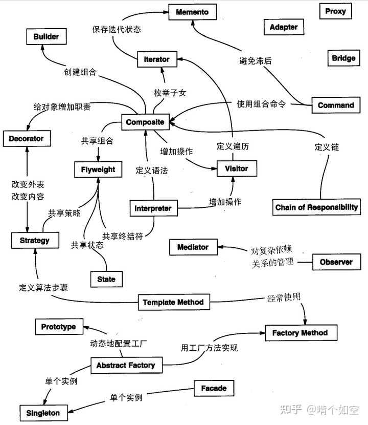

## 设计模式的初衷

设计模式使人们可以更加简单方便地复用成功的设计和体系结构，其最关键的元素包括以下 4 个主要部分。

### 1. 模式名称

每一个模式都有自己的名字，模式名称可以很好的用来描述模式解决的问题、模式的特点等。模式名称（PatternName）更加有助于我们理解和记忆该模式，也方便我们来讨论自己的设计。

### 2. 问题

问题（Problem）描述了该模式的应用环境，即何时使用该模式。它解释了设计问题和问题存在的前因后果，以及必须满足的一系列先决条件。

### 3. 解决方案

模式问题的解决方案（Solution）包括设计的组成成分、它们之间的相互关系及各自的职责和协作方式。因为模式就像一个模板，可应用于多种不同场合，所以解决方案并不描述一个特定而具体的设计或实现，而是提供设计问题的抽象描述和怎样用一个具有一般意义的元素组合（类或对象的 组合）来解决这个问题。

### 4. 效果

描述了模式的应用效果以及使用该模式应该权衡的问题，即模式的优缺点。主要是对时间和空间的衡量，以及该模式对系统的灵活性、扩充性、可移植性的影响，也考虑其实现问题。显式地列出这些效果（Consequence）对理解和评价这些模式有很大的帮助。

## 设计模式的理解和误区

设计模式要活学活用，不要生搬硬套。想要游刃有余地使用设计模式，需要打下牢固的程序设计语言基础、夯实自己的编程思想、积累大量的时间经验、提高开发能力。目的都是让程序低耦合，高复用，高内聚，易扩展，易维护。

### 1. 需求驱动

不仅仅是功能性需求，需求驱动还包括性能和运行时的需求，如互联网产品的可维护性和可复用性等方面。一定不要为了使用设计模式而使用设计模式，否则可能会使设计变得复杂，使产品难以调试和维护。

### 2. 分析成功的模式应用项目

对现有的应用实例进行分析是一个很好的学习途径，应当注意学习已有的项目，而不仅是学习设计模式如何实现，更重要的是注意在什么场合使用设计模式。

### 3. 充分了解所使用的开发平台

设计模式大部分都是针对面向对象的软件设计，因此在理论上适合任何面向对象的语言，但随着技术的发展和编程环境的改善，设计模式的实现方式会有很大的差别。在一些平台下，某些设计模式是自然实现的。

### 4. 在编程中领悟模式

程序开发是一项实践工作，最直接的方法就是编程。没有不会编程就能成为架构设计师的先例。掌握设计模式是水到渠成的事情，除了理论只是和实践积累，可能会“渐悟”或者“顿悟”。

### 5.避免设计过度

设计模式解决的是设计不足的问题，但同时也要避免设计过度。一定要牢记简洁原则，要知道设计模式是为了使设计简单，而不是更复杂。如果引入设计模式使得设计变得复杂，只能说我们把简单问题复杂化了，问题本身不需要设计模式。

这里需要把握的是需求变化的程度，一定要区分需求的稳定部分和可变部分。互联网产品必然有稳定部分，这个部分就是核心业务逻辑。如果核心业务逻辑发生变化，那么该产品就没有存在的必要，核心业务逻辑是我们需要固化的。对于可变的部分，需要判断可能发生变化的程度来确定设计策略和设计风险。要知道，设计过度与设计不足同样对项目有害。

需要特别注意的是，在平时开发过程中，设计模式往往都不是独立存在使用的,通常都是多个设计模式混合使用。下图描述了设计模式之间的混用关系，供大家参考:

总结: 设计模式顾名思义,设计中使用的成型的路数,但我们应做到以不变应万变,不要盲从设计模式,后续文章我们继续探讨和学习设计模式中面向对象的设计原则.