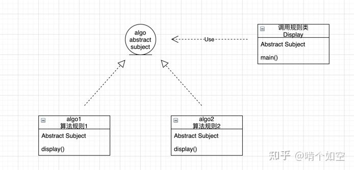

开闭原则（Open Closed Principle，OCP）软件实体应当对扩展开放，对修改关闭（Software entities should be open for extension，but closed for modification），这就是开闭原则的经典定义。

这里的软件实体包括以下几个部分：

1. 项目中划分出的模块
2. 类与接口
3. 方法

## 开闭原则的作用

开闭原则是面向对象程序设计的终极目标，它使软件实体拥有一定的适应性和灵活性的同时具备稳定性和延续性。具体来说，其作用如下。

### 1. 对测试的影响

测试的时候,只需要针对扩展代码进行测试即可,原有代码仍然可以正常运行,不会被污染。

### 2. 可以提高代码的可复用性

细粒度化,可被多次复用,提高代码的复用度

### 3. 可以提高软件的可维护性

遵守开闭原则的产品，其稳定性高和延续性强，从而易于扩展和维护

开闭原则的含义是：当应用的需求改变时，在不修改软件实体的源代码或者二进制代码的前提下，可以扩展模块的功能，使其满足新的需求。

案例:

在实际工作中,多个试验组算法会形成不同的实验数据,那么可以定义一个工程类,具体使用哪个算法规则,可以定义抽象算法类,golang中可以用interface的方式,不同的算法规则则去实现该interface即可,如下图所示:

总结:对扩展开放，对修改关闭,这是开闭原则的基本原理,可以多感悟一下,后续文章我们继续面向对象设计原则的分析.