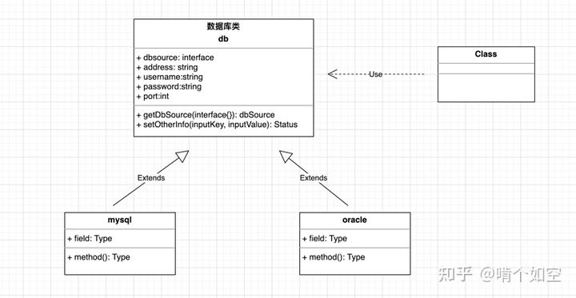

里氏替换原则（Liskov Substitution Principle，LSP）: 继承必须确保父类所拥有的性质在子类中仍然成立（Inheritance should ensure that any property proved about supertype objects also holds for subtype objects）,即,子类应该继承所有父类的非私有属性和方法.

里氏替换原则主要阐述了有关继承的一些原则，也就是什么时候应该使用继承，什么时候不应该使用继承，以及其中蕴含的原理。里氏替换原是继承复用的基础，是对开闭原则的补充，是抽象和实现的关系规范映射.

## 里氏替换原则的作用

里氏替换原则的主要作用如下。

1. 里氏替换原则是实现开闭原则的重要方式之一。
2. 它克服了继承中重写父类造成的可复用性变差的缺点。
3. 它是动作正确性的保证。即类的扩展不会给已有的系统引入新的错误，降低了代码出错的可能性。
4. 加强程序的健壮性，同时变更时可以做到非常好的兼容性，提高程序的维护性、可扩展性，降低需求变更时引入的风险。

## 里氏替换原则的实现方法

里氏替换原则通俗来讲就是：子类可以扩展父类的功能，但不能改变父类原有的功能。也就是说：子类继承父类时，除添加新的方法完成新增功能外，尽量不要重写父类的方法。

根据上述理解，对里氏替换原则的定义可以总结如下：

- 子类可以实现父类的抽象方法，但不能覆盖父类的非抽象方法
- 子类中可以增加自己特有的方法
- 当子类的方法重载父类的方法时，方法的前置条件（即方法的输入参数）要比父类的方法更宽松
- 当子类的方法实现父类的方法时（重写/重载或实现抽象方法），方法的后置条件（即方法的的输出/返回值）要比父类的方法更严格或相等

如果程序违背了里氏替换原则，则继承类的对象在父类出现的地方会出现运行错误。这时其修正方法是：取消原来的继承关系，重新设计它们之间的关系。

下面以“几维鸟不是鸟”为例来说明里氏替换原则。

案例:

一般在工作中,项目的开发中离不开数据库的使用,如果不做抽象处理,很有可能会造成代码冗余,而且各自的标准不一样,会让代码难以维护管理,因此可以把数据库的常规操作进行抽离,不同的数据库可以实现和加以拓展,如下所示:

